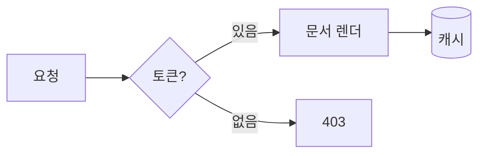
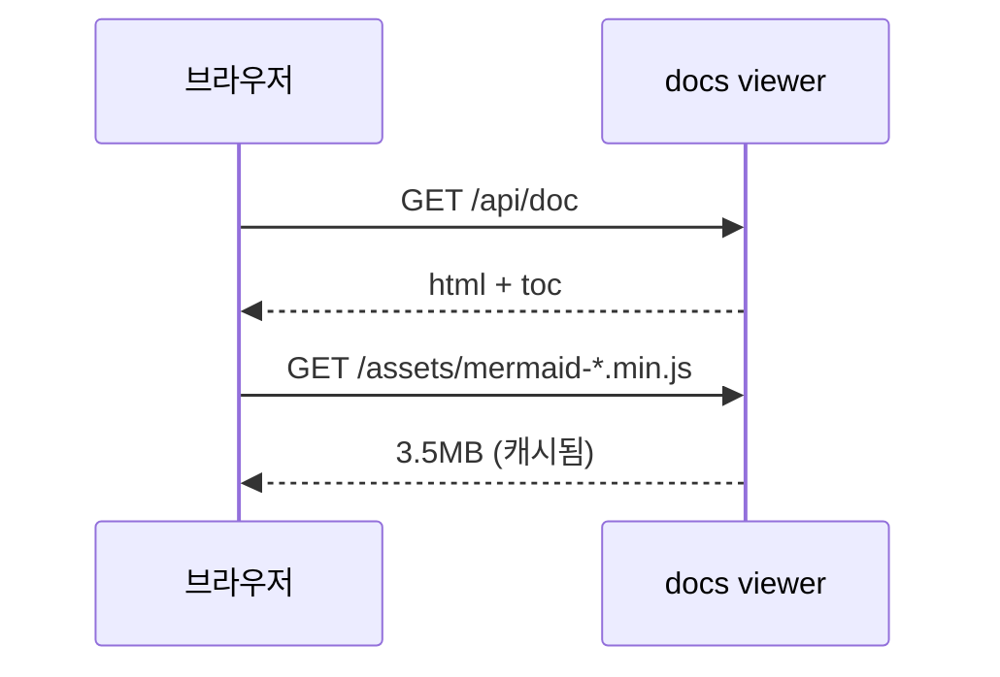

# mermaid 테스트

플로우차트:


```mermaid
flowchart LR
  A[요청] --> B{토큰?}
  B -- 있음 --> C[문서 렌더]
  B -- 없음 --> D[403]
  C --> E[(캐시)]
```

시퀀스:


```mermaid
sequenceDiagram
  participant U as 브라우저
  participant S as docs viewer
  U->>S: GET /api/doc
  S-->>U: html + toc
  U->>S: GET /assets/mermaid-*.min.js
  S-->>U: 3.5MB (캐시됨)
```

문법 오류 (원문이 그대로 남아야 함):

```mermaid
flowchart LR
  A -->
```

일반 코드 블록은 그대로:

```python
print("hello")
```
